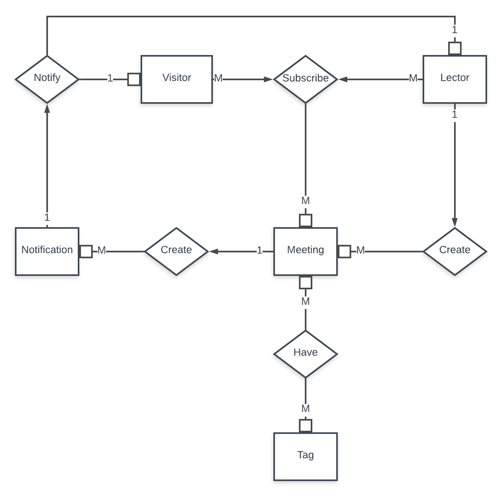

# MeetEnjoy
Приложение - агрегатор, которое предоставляет его пользователям удобный 
интерфейс для поиска интересующих лекций/встреч с разных сайтов или создание собственных в приложении, 
также получать уведомления о скором начале лекции, искать интересные митинги по локации и предпочтениям.

## Users

В даном приложении предоставлено два типа пользователей: Инициатор встреч (Lector) и посетитель (Visitor). 

### Visitor

В даном приложении посетитель имеет следующий ряд возможностей:
- фильтровать лекции по интересам;
- просматривать подробную информацию о лекции;
- просматривать подробную информацию лектора/инициатора встречи;
- регистрироваться на встречу или же отписыватся от нее;
- включать/отключать уведомления для предупреждения о скором начале лекции;
- ставить оценку за лекцию;

### Lector

В даном приложении лектор имеет те же возможности, что и посетитель, а так же ряд дополнительных возможностей:
- добавлять подробную информацию о себе;
- регистрировать лекции указывая место и время, длительность, тематику и количество посетителей;
- отменять лекции и редактировать их с последующим уведомлением пользователей подписаных на лекцию;

### Meeting

Также в даном приложении есть возможность создавать как свои лекции так и находить лекции с других сайтов 
(meetup.com, dou.ua, etc.) что позволяет удобно хранить информацию о всех интересующих митапах в одном приложении.

### ЕР диаграмма

### Tables

#### User (global)
| Поле | Тип | Описание | Default | NULL |
| --- | --- | --- | --- | --- |
| email | varchar | email пользователя | --- | No |
| phone | varchar | номер телефона | --- | Yes |
| location | json | (latitude, longitude) | --- | Yes |

#### Visitor
| Поле | Тип | Описание | Default | NULL |
| --- | --- | --- | --- | --- |
| user | ref(user) | foreign key на user | --- | No |

#### Lector
| Поле | Тип | Описание | Default | NULL |
| --- | --- | --- | --- | --- |
| user | ref(user) | foreign key на user | --- | No |
| description | text | полное описание лектора | --- | Yes |
| rate_count | int | количество оценок от пользователей | 1 | No |
| rate_summary | int | сумма всех оценок от пользователей | 0 | No |

#### Meeting
| Поле | Тип | Описание | Default | NULL |
| --- | --- | --- | --- | --- |
| title | varchar | название лекции | --- | No |
| description | text | полное описание встречи | --- | Yes |
| created_at | datetime | дата создания | now | No |
| published_at | datetime | дата публикации | --- | Yes |
| start_at | datetime | дата начала лекции | --- | Yes |
| duration | time | длительность лекции | --- | Yes |
| status | int | статус лекции (MeetingStatus) | 0 | No |
| location | json | (latitude, longitude) | --- | No |
| is_main | bool | создана ли лекция на сайте или лекция со стороннего сайта | true | No |
| from_site | int | название сайта с которого взята лекция | --- | Yes |
| from_url | int | url лекции со стороннего сайта | --- | Yes |
| creator | ref(lector) | создатель (lector) | --- | No |

#### Tag
| Поле | Тип | Описание | Default | NULL |
| --- | --- | --- | --- | --- |
| name | varchar | имя тега | --- | No |

#### Notification
| Поле | Тип | Описание | Default | NULL |
| --- | --- | --- | --- | --- |
| user | ref(user) | foreign key на user | --- | No |
| is_read | bool | прочитано ли уведомление | false | No |
| title | varchar | навание уведомления | --- | No |
| body | varchar | тело уведомления | --- | No |

#### MeetingParticipants
| Поле | Тип | Описание | Default | NULL |
| --- | --- | --- | --- | --- |
| visitor | ref(visitor) | foreign key на visitor | --- | No |
| meeting | ref(meeting) | foreign key на meeting | --- | No |

#### MeetingTags
| Поле | Тип | Описание | Default | NULL |
| --- | --- | --- | --- | --- |
| tag | ref(tag) | foreign key на tag | --- | No |
| meeting | ref(meeting) | foreign key на meeting | --- | No |

#### UserTags
| Поле | Тип | Описание | Default | NULL |
| --- | --- | --- | --- | --- |
| tag | ref(tag) | foreign key на tag | --- | No |
| user | ref(user) | foreign key на user | --- | No |

#### MeetingStatus (статусы лекций)
| Статус | Значеие | Описание |
| --- | --- | --- |
| DRAFT | 0 | лекция на стадии разработки |
| PUBLISHED | 1 | лекция опубликована на сайт |
| CANCELED | 2 | лекция отменена лектором |
| DELETED | 3 | лекция удалена |
| FINISHED | 4 | лекция завершена |
